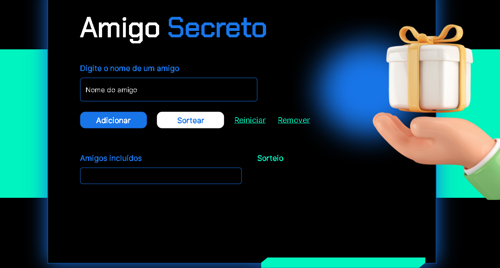

# Projeto Amigo Secreto

## Descrição:

O projeto Amigo Secreto implementa um sorteio de amigo secreto simples e divertido. Perfeito para confraternizações, festas de fim de ano ou qualquer ocasião em que você queira celebrar com seus amigos!

## Funcionalidades:

Adicione amigos à lista.
Verifique se um amigo já está na lista.
Sorteie pares de amigos secretos.
Visualize os pares sorteados.
Reinicie o sorteio a qualquer momento.
Remova amigos da lista.

## Tecnologias Utilizadas:

Este projeto oferece uma experiência interativa para facilitar a organização do seu amigo secreto, proporcionando diversão e praticidade para você e seus amigos!